# VitalX Architecture Diagrams

**Visual Reference for Streaming Refactor**

---

## 🏗️ SYSTEM ARCHITECTURE (Target State)

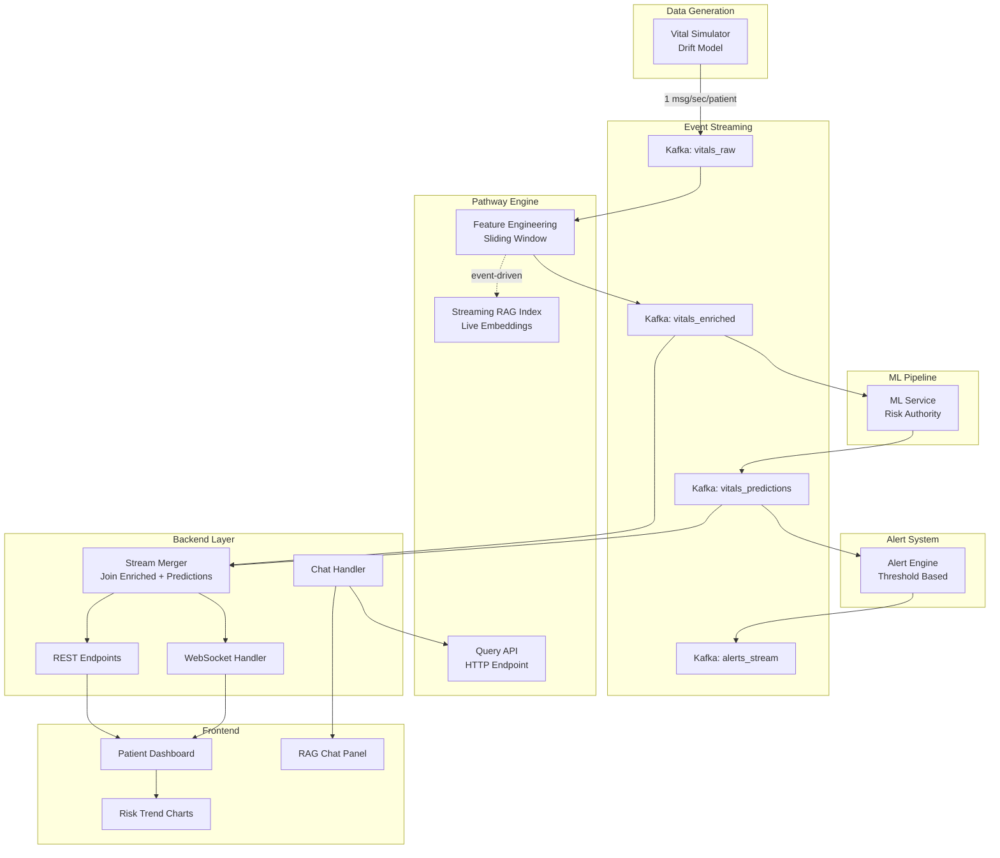

---

## 🔄 DATA FLOW SEQUENCE

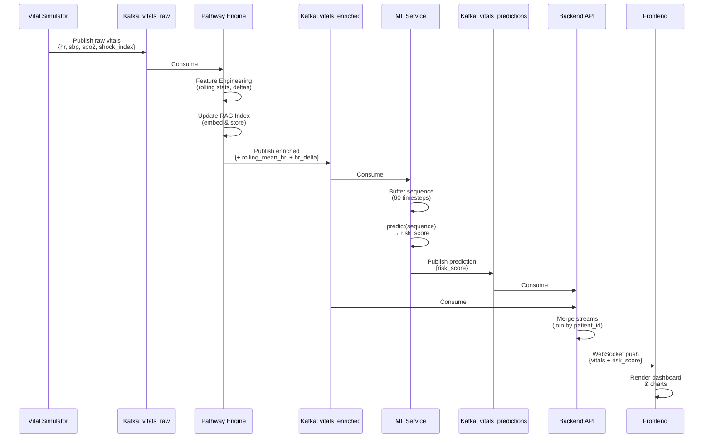

---

## 🧩 SERVICE RESPONSIBILITY BREAKDOWN

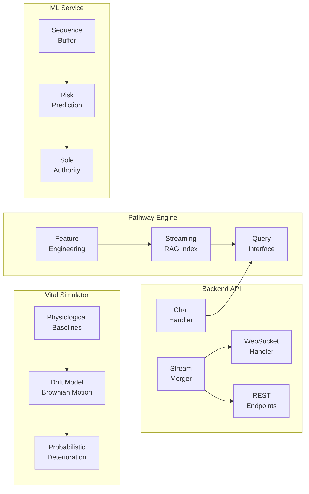

---

## 🔀 BEFORE vs AFTER DATA FLOW

### BEFORE (Problematic)

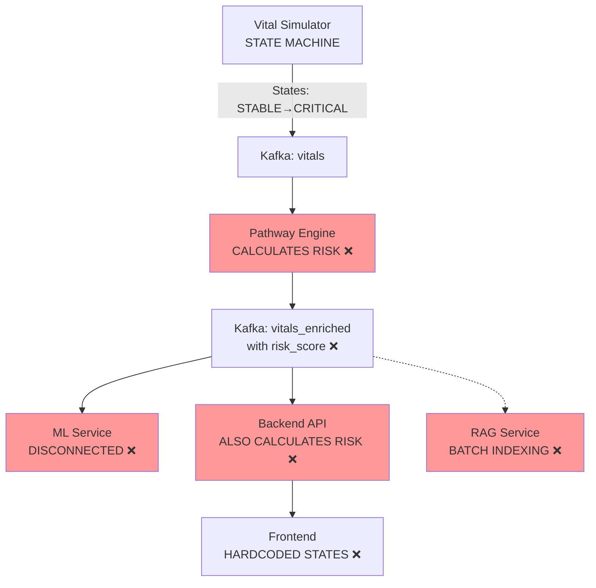

### AFTER (Streaming-First)

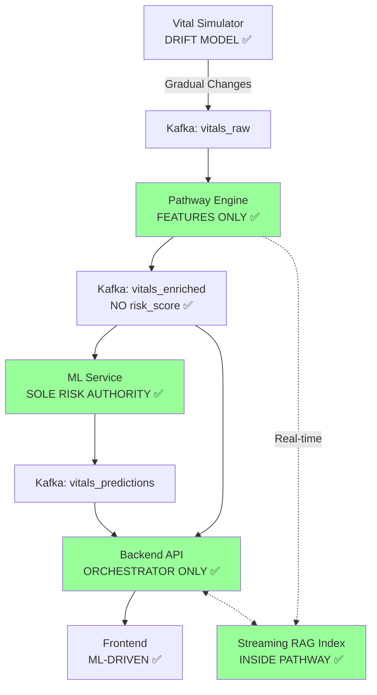

---

## 🎯 KAFKA TOPIC TOPOLOGY

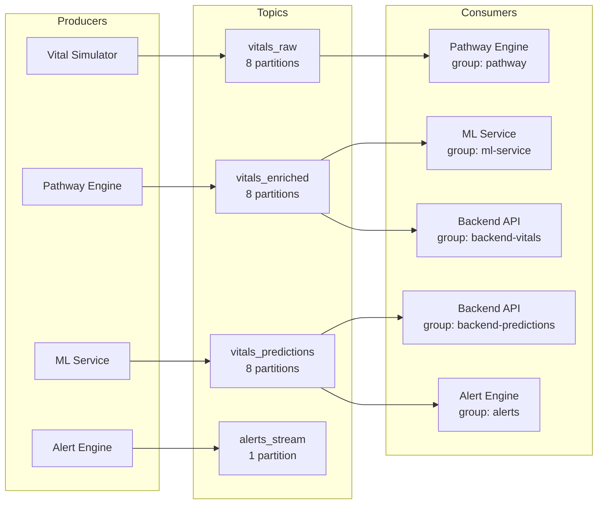

---

## 🔍 PATHWAY ENGINE INTERNALS

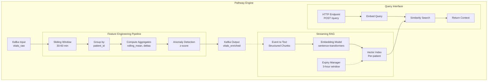

---

## 🤖 ML SERVICE PIPELINE

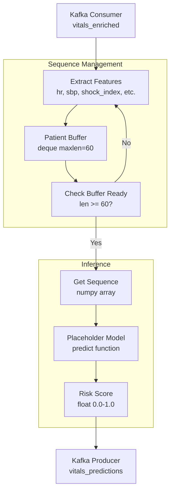

---

## 🌐 BACKEND API ARCHITECTURE

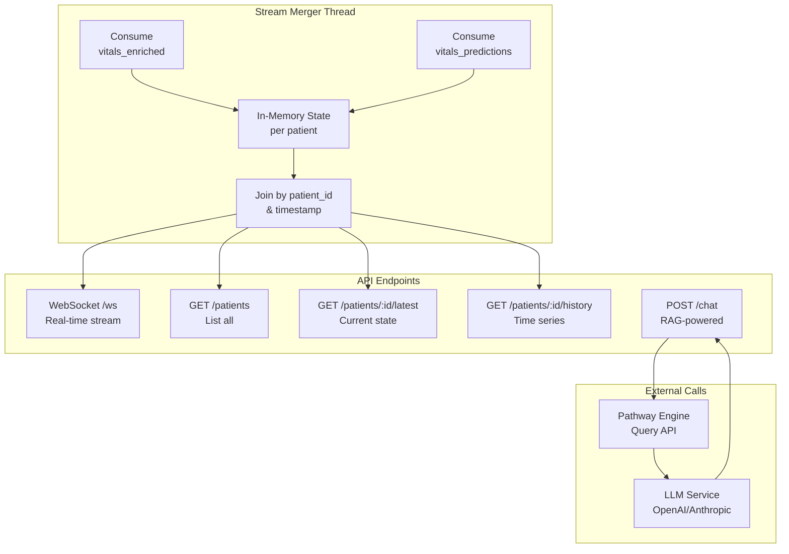

---

## 🎨 FRONTEND COMPONENT HIERARCHY

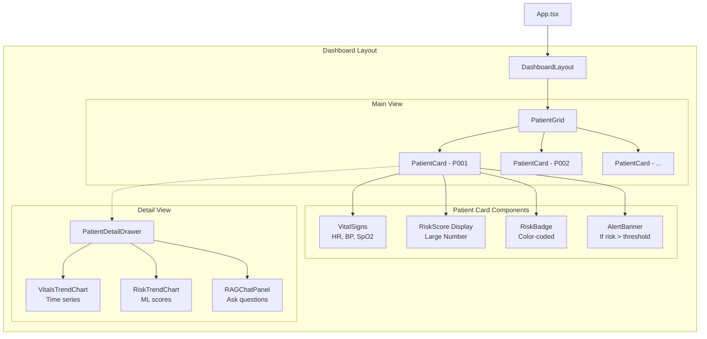

---

## 🔐 SECURITY & ISOLATION

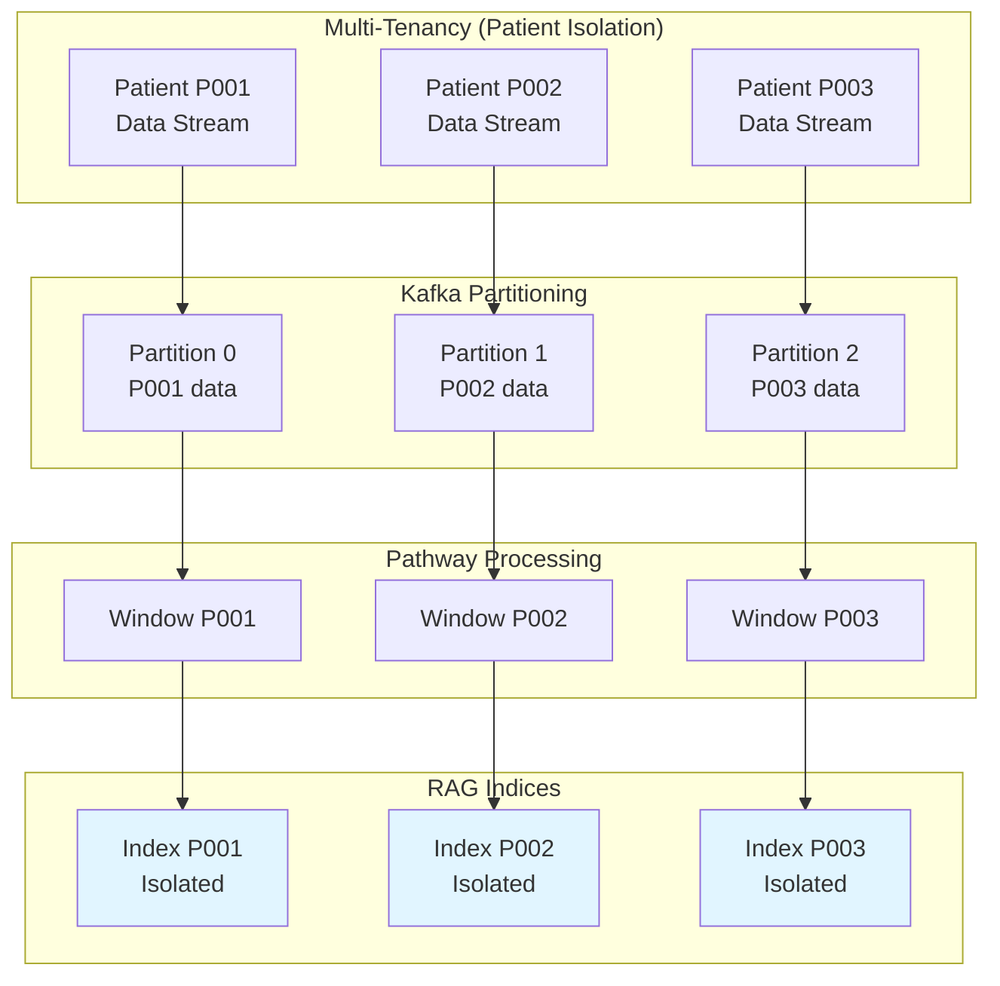

---

## 📈 SCALING ARCHITECTURE

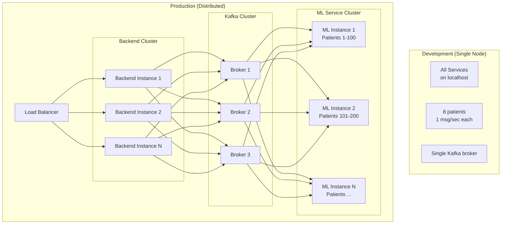

---

## 🔧 DEPLOYMENT ARCHITECTURE

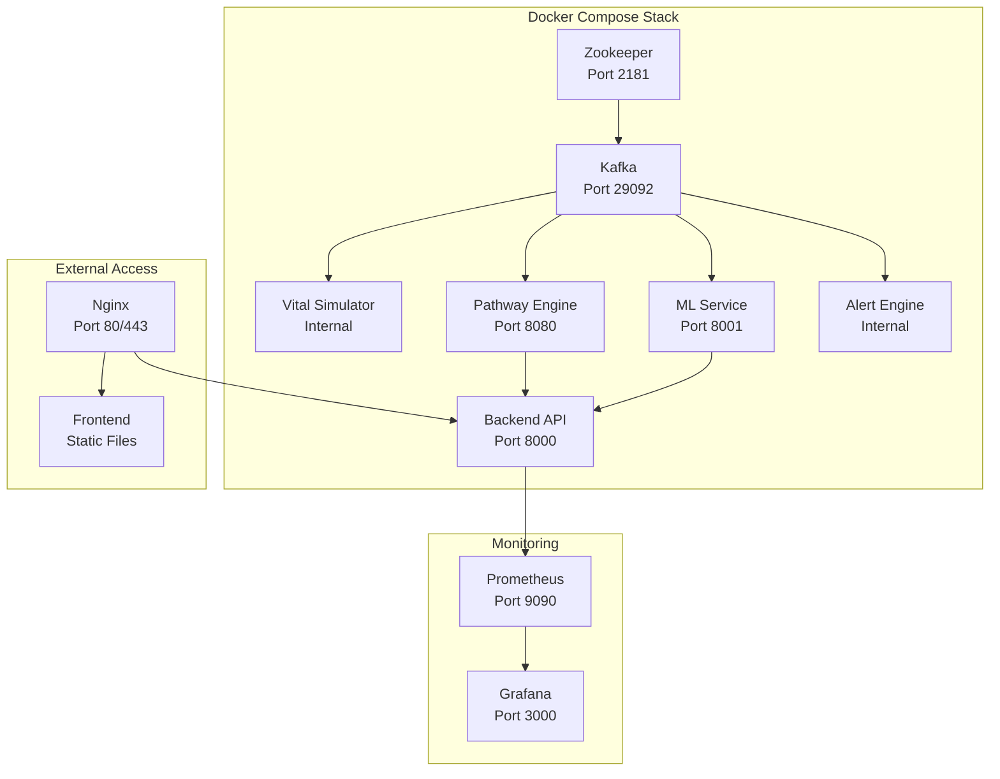

---

## 📊 MONITORING DASHBOARD LAYOUT

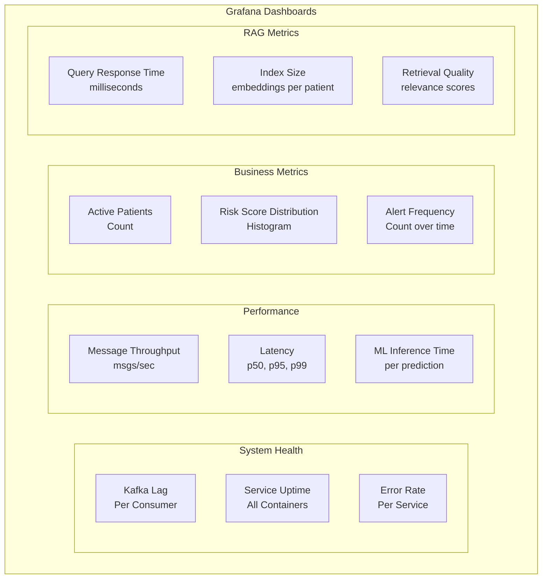

---

## 🎯 IMPLEMENTATION PHASES TIMELINE

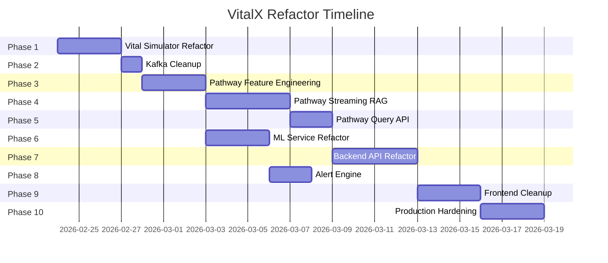

---

**Note:** These diagrams are written in Mermaid syntax and will render in:
- GitHub markdown files
- VS Code with Mermaid extension
- Documentation sites (GitBook, Docusaurus, etc.)
- Confluence with Mermaid plugin

**Rendering Instructions:**
1. Install Mermaid extension in VS Code
2. Preview this markdown file
3. Diagrams will render interactively

**Export Options:**
- PNG: Use Mermaid CLI or online editor
- SVG: For high-quality documentation
- PDF: For presentations
